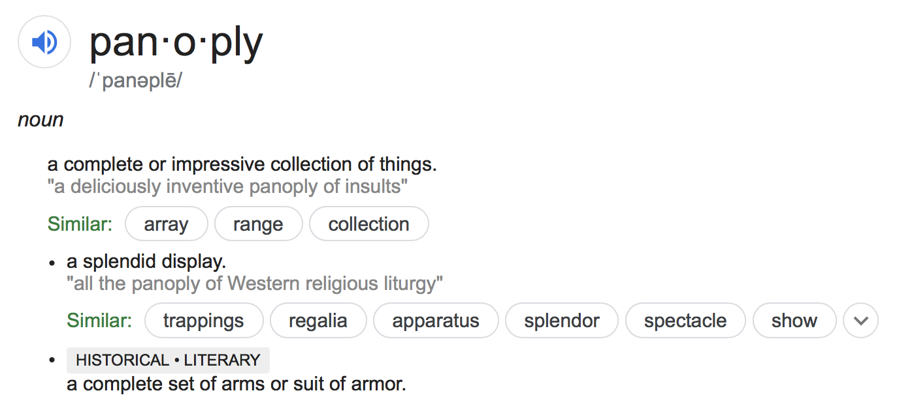

# panoplyCF
R package implementing the panoplyCF clustering algorithm for flow (and mass) cytometry

## Installing the package
*Please note that the vignette takes a few minutes
to build because the example dataset is a bit on the large side (~10 mb).*
```
devtools::install_github("rogerswt/panoplyCF", build_vignettes = TRUE)
```

*Also note that some platforms are having trouble building the vignette.  If this is
your situation, you can omit the vignette.*  
```
devtools::install_github("rogerswt/panoplyCF")
```


## Background

The prevalence of high-dimensional flow (or mass) cytometry data is increasing at a rapid pace.
The difficulties and limitations of manual analysis of such data are obvious to anyone who has
tried to do that.  The alternative is to find or create automated analysis approaches that
facilitate this process.

There has been much recent interest in the use of manifold-learning algorithms to reduce the
dimensionality of cell-based data to manageable levels.  t-SNE and UMAP are two examples.
One difficulty in common between these approaches is their computational complexity
as the total number of events and the number of measured variables for each event increase.
Another limitation, specific to t-SNE, is that a map learned on one data set cannot
be applied to another data set without re-computing the imbedding.

## PanoplyCF
I developed panoplyCF to address these limitations.  PanoplyCF first computes high-resolution 
Cytometric Fingerprinting (CF) bins using FlowFP.  It then computes the centroids of the bins
in high-dimensional space by taking the medians for each independent variable for all
events contained in each bin.  It then computes the t-SNE embedding **of the bin
centroids**.  This has two advantages over conventional t-SNE:

* it's fast.  It only has to deal with thousands of bins rather than millions of events.
* it's re-useable.  New data can be inserted into an existing embedding via the CF bins.

The final step is to perform conventional hierarchical agglomerative clustering of the
bins, using the 2-dimensional t-SNE map coordinates.  The goal is to create clusters
that are homogeneous in high-dimensional space as determined by the tightness of 
the distribution of the independent variables within each cluster.

How well this works depends on the nature of the data that the algorithm is fed. Manifold
learning algorithms work best when there is a manifold present in the data to be learned.
As discussed in (https://www.nature.com/articles/s41467-019-13055-y) some data are
more "manifold-like", whereas some are more "cluster-like".  If your data fall in the
former category, panoplyCF may work well.  If in the latter, you may have more luck
with clustering approaches such as flowClust or flowSOM.

## Citation
PanoplyCF is as yet unpublished.  Please acknowledge me if you use panoplyCF for publication,
and drop me a note as well!

[Wade Rogers](mailto:wade.rogers@spcytomics.com)

[Still Pond Cytomics](https://spcytomics.com)
